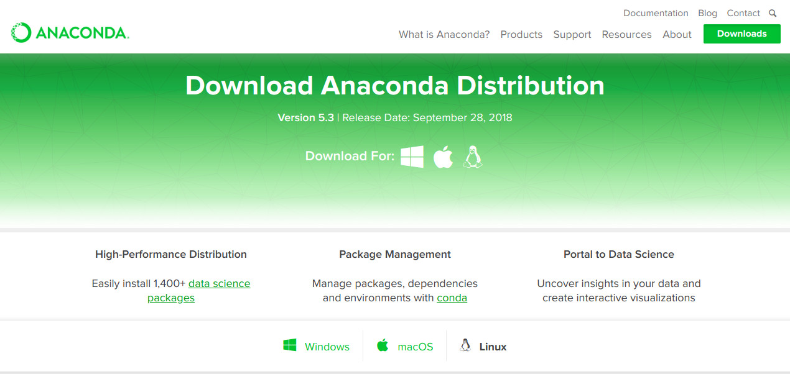

# Saya Mau Belajar Python, Mulai Dari Mana?

Selamat datang di repository sekapur sirih Surabaya.py. Disini dikumpulkan berbagai *resource* untuk belajar python bagi pemula hingga advance. Silahkan belajar dan berkontribusi.

**Daftar Isi**
* [Bagaimana Cara Menggunakan Repository Ini](#bagaimana-cara-menggunakan-repository-ini?)
    * [Belajar Disini](#belajar-disini)
    * [Kontribusi Disini](#kontribusi-disini)
* [Mengenal Python dan Perbedaan dengan Bahasa Lain](#mengenal-python-dan-perbedaan-dengan-bahasa-lain)
    * [Python adalah Intepreted Programming](#python-adalah-intepreted-programming)
    * [Perbedaan Python 2 dan Python 3](#perbedaan-python-2-dan-python-3)
* [Apa Langkah Awal Belajar Python](#langkah-awal-belajar-python)
    * [Install Python](#install-python)
    * [Menggunakan IDLE](#menggunakan-python-shell--idle)
    * [Menggunakan IDE](#menggunakan-IDE)
    * [Menggunakan Code Editor](#menggunakan-code-editor)
    * [Menggunakan Jupyter Notebook](#menggunakan-jupyter-notebook)
* [Basic Coding](#basic-coding)
* Intermediete Coding
* [Cara Instalasi Menggunakan Anaconda](#cara-instalasi-menggunakan-anaconda)
* Proyek Open Source Surabaya.py


## Bagaimana Cara Menggunakan Repository Ini?
### Belajar Disini
Untuk belajar disini, cukup membuka seluruh isi repository ini di halaman github. Sangat direkomendasikan untuk berurutan berdasarkan daftar isi yang telah disediakan.

Jika lebih senang belajar secara *offline*, maka diperlukan install Python dan Jupyter notebook terlebih dahulu. Lalu bisa dilakukan download repository ini maupun melakukan `git clone`.

### Kontribusi Disini
Kami sangat terbuka bagi teman-teman komunitas untuk ikut berkontribusi dalam membangun komunitas kita. Ada beberapa cara yang bisa dilakukan:
* Mengirimkan issue tentang ide apa yang bisa di implementasikan.
* Clone dan kembangkan berbagai topik lalu kirim Pull Request.
* Ngobrol dan diskusi di grup telegram kita.
* Ikut kegiatan Workshop, Seminar maupun Mentoring yang diadakan Surabaya.py

## Mengenal Python dan Perbedaan dengan Bahasa Lain
### Python adalah Intepreted Programming


### Perbedaan Python 2 dan Python 3
Python 2 akan segera berakhir masa dukungannya sehingga sangat direkomendasikan untuk belajar Python 3 Saja.

*Gambar diambil Tanggal 18 April 2018*
    
## Langkah Awal Belajar Python
### Install Python
Seperti yang telah dijelaskan sebelumnya, jika mulai belajar disarankan untuk menggunakan Python3. Ada beberapa cara instalasi Python berdasarkan Sistem Operasi yang digunakan:
#### Linux / Mac OS
> Secara Default, Linux dan Mac OS **telah terinstall Python**. Tinggal Buka terminal dan ketik `python` lalu akan muncul python shell (dimulai dari tanda `>`). Jika ingin menggunakan python 3, maka peritah pada terminal menjadi `python3`. Proses instalasi yang dibutuhkan hanya jika ingin melakukan upgrade versi Python.

#### Windows
Untuk Windows, diperlukan instalasi terlebih dahulu dengan mendownload di [web resmi python](https://www.python.org/downloads/) dan lakukan instalasi seperti biasa. Jangan lupa untuk menambahkan Python pada PATH ketika instalasi.


### Menggunakan Python Shell / IDLE
Buka `terminal` (Linux / Mac OS) atau `command prompt`/`power shell` (Windows) lalu ketikan python. Atau pada Windows juga bisa membuka aplikasi bernama IDLE jika telah menginstall python. Jika pada komputer terinstall python 2 dan python 3 (seperti pada Ubuntu), maka untuk menjalankan python 3 harus ditulis `python3`. Ketika python shell muncul, cukup ketikan syntax python dan output akan langsung dikeluarkan.


Sering juga kita membuat sebuah file dengan ekstensi `.py` yang berisi syntax python misal program `test.py`:
```python3
for i in range(10):
    print('*' * (i+1) )
```
Maka pada terminal (di luar python shell) kita bisa memanggilnya dengan cara `python3 test.py`.


Jika sebelumnya telah berada di python shell (dengan `>` diawal), maka bisa juga program tersebut dijalankan dengan cara 
```
import test
```
dimana `test` adalah nama file tanpa ekstensi. Keuntungan menjalankan di python shell adalah seluruh variabel yang dijalankan pada program akan tersimpan pada sesi tersebut, sehingga sangat memudahkan untuk debugging. Misal program diatas ditambahkan variabel `a = 1000`.

```python3
a = 1000
for i in range(10):
    print('*' * (i+1) )
```

maka variabel tersebut dapat dipanggil dengan cara:

```python3
test.a
```


### Menggunakan IDE
IDE memudahkan untuk bekerja di environment python, biasanya lengkap dengan syntax highlighting, debugging tool, auto completion dan sebagainya. Bisa menggunakan [PyCharm](http://www.jetbrains.com/pycharm/download/)


Tampilah salah satu IDE (Pycharm)

### Menggunakan Code Editor
Code editor biasanya memiliki sifat dapat digunakan untuk berbagai bahasa pemrograman dan hanya memiliki fungsi untuk menulis programnya saja. Misalnya Notepad, Gedit, Nano dan sebagainya. Tapi code editor modern sekarang lebih canggih dengan memiliki fitur syntax highlighting, auto indentation dan mungkin juga ada untuk debugging. Beberapa contoh code editor seperti [sublime](https://www.sublimetext.com/3), [atom](https://atom.io/) dan [visual studio code](https://code.visualstudio.com/download).


Tampilah salah satu Code Editor (VS Code)

### Menggunakan Jupyter Notebook
Jupyter adalah code editor berbasis web based dan juga berbasis interactive python. Program dijalankan per blok dan memudahkan untuk melakukan pengujian program maupun visualisasi karena tidak perlu menjalankan seluruh program setelah mengedit sedikit program.


[Cara instalasi jupyter](http://jupyter.readthedocs.io/en/latest/install.html) :

#### Menggunakan Anaconda
Anaconda secara otomatis menginstall Python, Jupyter Notebook, dan paket lain yang biasa digunakan untuk scientific computing dan data science. Download di https://www.continuum.io/downloads. Setelah berhasil di install, maka Jupyter dapat dijalankan dengan cara membuka terminal dan masukan perintah:
```
jupyter notebook
```

#### Menggunakan Pip
Jika tidak ingin mendownload semua package yang disediakan Anaconda, bisa juga menginstall jupyter notebook menggunakan terminal dengan memberikan perintah:
```
pip3 install jupyter
```

Jika terdapat error tentang `permission denied`, maka dapat diubah menjadi seperti dibawah jika diinstall pada sistem:
```
sudo pip3 install jupyter
```
atau seperti dibawah jika hanya pada user saat ini
```
pip3 install jupyter --user
```

## Basic Coding
Basic coding bisa dimulai dari membuka [`1. Basic.ipynb`](https://github.com/surabaya-py/sekapur-sirih/blob/master/1.%20Basic%20Coding.ipynb). 

Jika ingin mengubah maupun mencoba sendiri, silahkan menginstall Jupyter Notebook. Untuk cara instalasinya bisa melihat [tutorial di atas](#Menggunakan-Jupyter-Notebook). Setelah melakukan instalasi, clone repo ini dan buka file [`1. Basic.ipynb`](#) pada jendela Jupyter Notebook.

## Cara Instalasi Menggunakan Anaconda
Download installer Anaconda pada link berikut:
[Anaconda installer for Linux](https://www.anaconda.com/download/).

Pada halaman download, pilih file installer untuk Python3.x.

Setelah mengunduh, pada jendela Terminal jalankan perintah berikut:
```
bash Anaconda-latest-Linux-x86_64.sh
```


Ikuti langkah-langkah yang tampil di jendela installer.

Jika teman-teman tidak yakin untuk pengaturan, pilih pengaturan default. Jangan khawatir karena ini nanti dapat diubah.

Untuk membuat perubahan, tutup dan buka kembali jendela Terminal.

Untuk menguji instalasi, pada jendela Terminal atau Anaconda Prompt, jalankan perintah conda list.
```
conda list
```

## Dari komunitas untuk komunitas
Repo ini dibuat oleh dukungan komunitas agar dapat menjadi media belajar yang terbaik dan jauh lebih baik. Berikut adalah nama-nama kontributor pada repo ini:

* [Tegar Imansyah](https://github.com/tegarimansyah)
* [Muhammad (Dyhaz)](https://github.com/dyhaz)
* May be you?
* Of course you!
